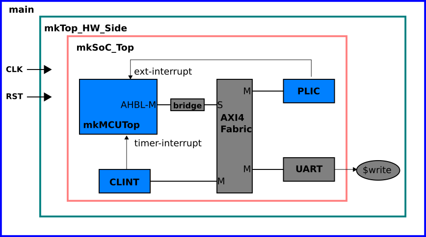

= Demonstration of MCU Running FreeRTOS in a Questa Simulation
v1.0, May 31, 2022. Bluespec, Inc.
:icons: font
:data-uri:

This demo contains files and scripts for:

. Compiling a Questa simulation executable from source files for the hardware system shown below

. Running the simulation with a FreeRTOS `main_blinky` ELF file
  loaded into the TCMs inside `mkMCUTop` and executed by the MCU. The
  FreeRTOS C source code and Makefile is not packaged in this demo
  but is available on request.

== System Hierarchy

.Simulation System


=== mkSoC_Top

Connects the MCU processor (`mkMCUTop`) to PLIC,
CLINT and UART devices via an AHBL-to-AXI4 bridge and an 1x3 AXI4
fabric. The AHB-L and AXI4 interconnects are 32-bit wide. 

The MCU's Debug Module (`mkBSDebug`) is not connected. The MCU has
been generated with 1024 KB ITCM and DTCM memories and does not
implement the TCM loader interface. To improve simulation speed,
programs are loaded directly into the TCM memories.

The UART is not a fully functional UART for this demo. It is used
only in output mode to transmit program output through the `$write`
simulation function.

=== mkTop_HW_Side and main

`mkTop_HW_Side` connects the simulation SoC to the top-level
testbench functions. It also plumbs the CLK and RST
signals from the level above. `main` serves as the top-level
simulation wrapper providing a clock and reset and other simulation
controls like verbosity.

== Directory Structure

[cols="20,~"]
|===

| bin
| Utilities to compile and run the Questa simulation

| build
| Directory from which the Questa simulation must be compiled and run

| C_VPI
| VPI C files (e.g. for UART input when used)

| lib/Verilog
| Top-level TB files (main.v)

| lib/C
| C code to import TB routines

| programs
| FreeRTOS main_blinky asm and ELF files

| MCU.1024K.AHBL
| RTL source for simulation

| tools
| Elf-to-Hex utility for loading of TCMs

|===

<<<

== Running the Demo

=== Questa Notes

. Version 2019.1 linux_x86_64 Jan 1 2019 run on Debian
. The following was necessary to run Questa:
```
export MTI_VCO_MODE=64
```

=== Steps

All the steps to build the Questa exectuate and run the simulation
must be done from the `build` directory. Create a `build` directory
if it does not exist already.

```
$ mkdir -p build                 # from questa-rtos
```

```
$ cd build                       # from questa-rtos
$ ../bin/MCU_compile_Questa.sh   # build the Questa executable
$ ../bin/run_MCU_Questa.sh       # load FreeRTOS and run the executable
```

After some initial simulation output, FreeRTOS will start running
in about 60 second and until terminated with Ctrl-C will continue
printing lines of the form:

```
# [0]: Hello from RX
#
# [0]: Hello from TX
#
# [1] TX: awoken
#
# [1] RX: received value
#
# Blink !!!
```

NOTE: The memory images that are loaded into the ITCM and DTCM are
created in `/tmp/itcm.mem` and `/tmp/dtcm.mem`. Please ensure that
these locations are writable.
